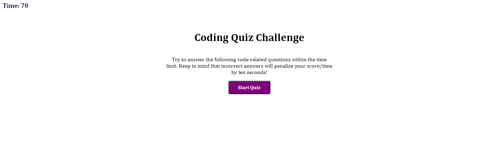

# Coding-Quiz-Game

## Description

This app was designed to be a short quiz game with questions related to the Coding Bootcamp and what we have learned so far. There are five questions, a timer, a leaderboard with scores, and scores that are stored in the local storage of the page. 

## Usage

This app functions simply, using mostly button click inputs and one form entry for initials at the end of the quiz. For every wrong answer, the timer is diminished by 10 seconds and the screen will show whether the question was answered correctly or incorrectly. Upon finishing the quiz, the user will be shown their score and be able to enter their initials. Their intials and score are then shown on the leaderboard screen and stored in the local storage of the page. 

The app is live at this URL: https://lamperouge1218.github.io/Coding-Quiz-Game/

and here is a screenshot of the final product's intial page: 

## Credits

For this project, I collaborated with [Mark Lindsey](https://github.com/mrl-jr). I also used the sites [W3Schools](https://www.w3schools.com/) and [MDN Web Docs](https://developer.mozilla.org/en-US/) to assist with for loops.

## License 

MIT License

Copyright (c) [2021] [PhilBohn]

Permission is hereby granted, free of charge, to any person obtaining a copy
of this software and associated documentation files (the "Software"), to deal
in the Software without restriction, including without limitation the rights
to use, copy, modify, merge, publish, distribute, sublicense, and/or sell
copies of the Software, and to permit persons to whom the Software is
furnished to do so, subject to the following conditions:

The above copyright notice and this permission notice shall be included in all
copies or substantial portions of the Software.

THE SOFTWARE IS PROVIDED "AS IS", WITHOUT WARRANTY OF ANY KIND, EXPRESS OR
IMPLIED, INCLUDING BUT NOT LIMITED TO THE WARRANTIES OF MERCHANTABILITY,
FITNESS FOR A PARTICULAR PURPOSE AND NONINFRINGEMENT. IN NO EVENT SHALL THE
AUTHORS OR COPYRIGHT HOLDERS BE LIABLE FOR ANY CLAIM, DAMAGES OR OTHER
LIABILITY, WHETHER IN AN ACTION OF CONTRACT, TORT OR OTHERWISE, ARISING FROM,
OUT OF OR IN CONNECTION WITH THE SOFTWARE OR THE USE OR OTHER DEALINGS IN THE
SOFTWARE.